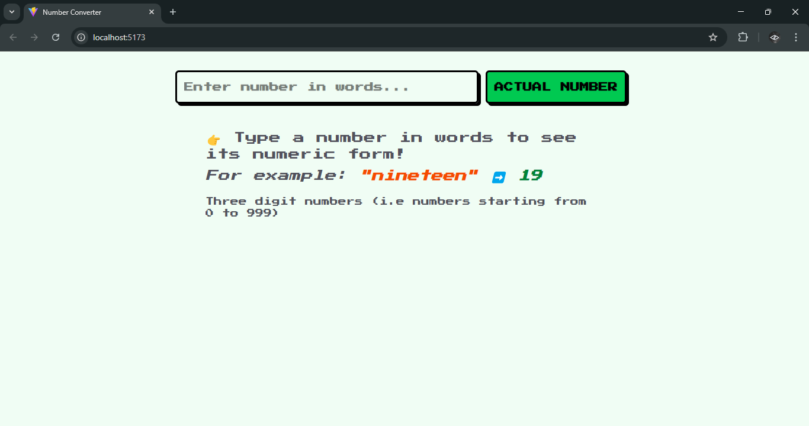
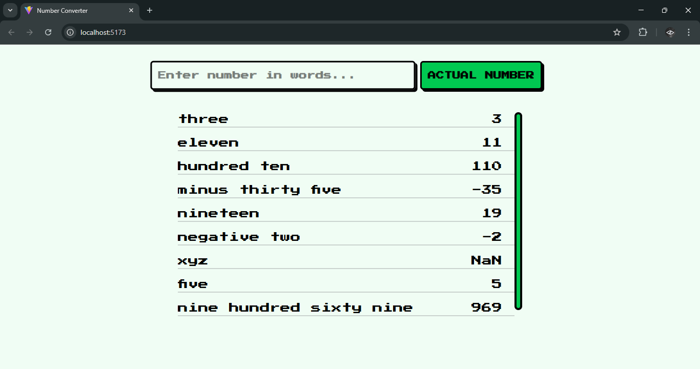

# Word to Number Converter

It is a simple application that converts English number words into their numeric equivalents (three digits only). For example, it can transform "five hundred twenty" into 520.

## Technology Stack
1. **BACKEND:** Node.js + Express
2. **FRONTEND:** React

## Dependencies
1. **BACKEND:** ```npm i express morgan joi cors```
2. **FRONTEND:** ```npm i axios tailwindcss```


## Usage
### 1. Clone the repository
```bash
git clone https://github.com/gaurav1-9/wordToNumber.git
cd wordToNumber
```

### 2. Installing the dependencies
- **SERVER:**
```bash
cd server
nmp install
```
- **CLIENT:**
```bash
cd client
nmp install
```

### 3. Running the server and React frontend
- **RUNNING THE SERVER:**
```bash
cd server
node index.js
```
- **RUNNING THE REACT FRONTEND:**
```bash
cd client
npm run dev
```

## Project Screenshots



## Contribution
Feel free to fork the repo and create pull requests with improvements.